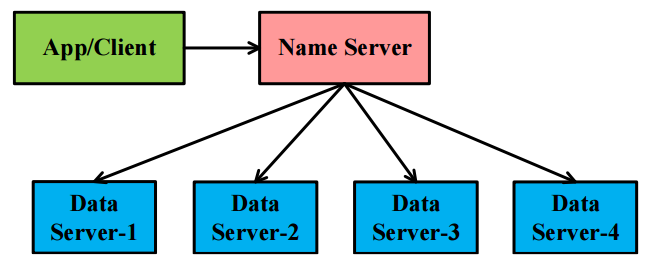

# Mini-DFS

- **A Mini Distributed File System (Mini-DFS), which contains**

  - A client

  - A name server

  - Four data servers



- **Mini-DFS is running through a process. In this process, the name server and data servers are different threads**

- **Basic functions of Mini-DFS**

  - Read/write a file

  - **Upload** a file: upload success and return the ID of the file
  - **Read** the location of a file based on the file ID and the offset

- **File striping**

    - Slicing a file into several chunks
    - Each chunk is 2MB
    - Uniform distribution of these chunks among four data servers

  - Replication

    - Each chunk has three replications
    - Replicas are distributed in different data servers

- **Name Server**

  - List the relationships between file and chunks
  - List the relationships between replicas and data servers
  - Data server management

- **Data Server**

  - Read/Write a local chunk
  - Write a chunk via a local directory path

- **Client**

  - Provide read/write interfaces of a file

- **directory management**

  - Write a file in a given directory
  - Access a file via "directory + file name"

- **Recovery**

  - Delete a data server (three data servers survive)
  - Recover the data in the lost data server
  - Redistribute the data and ensure each chunk has three replicas

## Requirements

```
colorama==0.4.4 # colorful print
```

## Examples

#### Client Prompt

```shell
$ python main.py 
Support operations: help|exit|mkdir|deldir|exists|ls|tree|upload|download|read|delds|recover
[MiniDFS]$ help 
Usage: help [command]
To show the help information of command

[MiniDFS]$ help read
Usage: read [file] [loc] [offset]
read a file from `loc` to `loc + offset`

[MiniDFS]$ 
```

#### Directory Operations

```shell
[MiniDFS]$ ls

[MiniDFS]$ mkdir a
[MiniDFS]$ ls
a  
[MiniDFS]$ mkdir a/b/c
[MiniDFS]$ ls a
b  
[MiniDFS]$ 
```

#### File Operations

```shell
[MiniDFS]$ upload data a
[MiniDFS]$ tree
{'.files': set(), 'a': {'.files': {'data'}, 'b': {'.files': set()}}}
[MiniDFS]$ exists a/data
True
[MiniDFS]$ ls a
data  b  
[MiniDFS]$ read a/data 0 10
b'versity wi'
[MiniDFS]$ read a/data 10 10
b'th your GP'
[MiniDFS]$ read a/data 10000 20
b'ting ( Android ) : H'
[MiniDFS]$ download a/data save
[MiniDFS]$ 
```

#### Server Operations

```shell
$ # manually delete dataserver2
[MiniDFS]$ recover 2
[MiniDFS]$ check_md5sum
True
[MiniDFS]$
```

